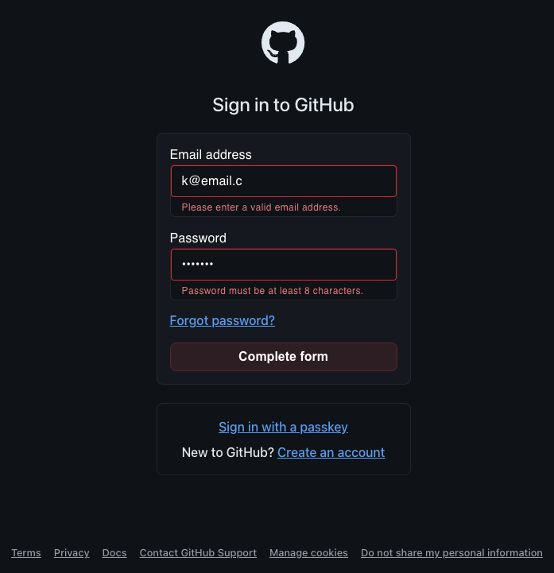
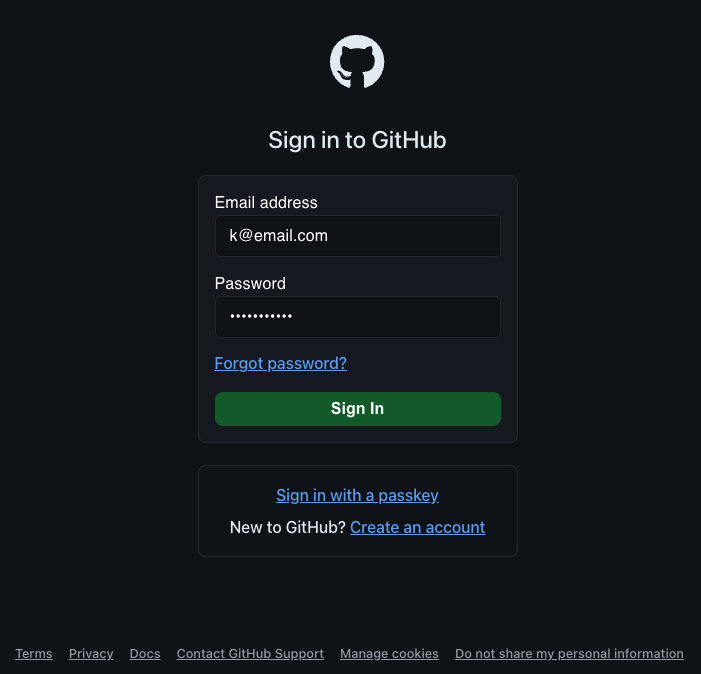
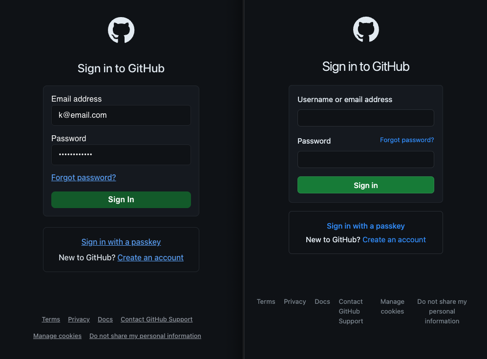

# TypeScript Login

## Table of Contents

- [About](#about)
  - [Task Criteria](#task-criteria)
  - [Validations](#validations)
  - [Styles](#styles)
- [Tools & Tech](#tools--tech)
- [Images](#images)
  - [States](#states)
  - [GitHub Comparison](#github-comparison)
- [Getting Started](#getting-started)

## About

Check out the deployed version here: [https://typescript-login-kayleriegerpattons-projects.vercel.app/](https://typescript-login-kayleriegerpattons-projects.vercel.app/)

### Task Criteria

This login page was first built as part of a technical assessment with the following criteria:

1. Input fields
   - two input fields are required, an email field and a password field.
   - Both fields should be able to validate their content. The email should be a valid email. Use any (not all) of the rules mentioned in this [password policy](https://www.ory.sh/docs/concepts/password-policy) to validate the password.
2. Login button
   - Enabled when the values for both the email and input fields pass the respective validation.
   - If clicked, a local storage entry should be stored in the user's browser containing the email address.

### Validations

- Email field:
  - validates email format
- Password field:
  - minimum 8 characters
  - no character type limit (allows all printable ASCII characters)
  - no composition rules
  - allows pasting

### Styles

The page is styled after [GitHub's login](https://github.com/login) within the limitations of the task criteria (ex. the `Email` field does not also allow Username like GitHub does).

I made some additional changes for accessibility reasons and personal preference (discussed further below in [GitHub Comparison](#github-comparison)).

## Tools & Tech


  
Deployed with 

## Images

### States

| Error State                                                           | Healthy State                                                             |
| --------------------------------------------------------------------- | ------------------------------------------------------------------------- |
|  |  |

### GitHub Comparison

Mine on the left and GitHub on the right:


#### Changes I made from the original:

1. `Email` field does not also allow Username (task criteria).
2. "Forgot password?" link is moved below the `Password` field.
3. Button background darkened to meet [WCAG AAA guidelines for color contrast](https://www.w3.org/WAI/WCAG21/Understanding/contrast-enhanced.html), despite it being an exempt "user interface component". Because why limit enhanced contrast on form elements when it's a simple change?
4. Re-styled links in lighter text color for enhanced contrast and with an underline in order to indicate their function by more than color (WCAG Success Criteria 1.4.1, 1.4.6; see [Technique G183](#https://www.w3.org/TR/2008/NOTE-WCAG20-TECHS-20081211/G183)).
5. Altered the wrap style of the footer links.

Bonuses:

1. Because the button is disabled by default, I also designed the disabled button variant in a red tone with different label text (see [error state](#states) above).
2. I completely changed the error state displays based on MUI's implementation and customized the helper text CSS for enhanced color contrast.

## Getting Started

This project was bootstrapped with [Create React App](https://github.com/facebook/create-react-app).

### Setup Instructions

1. Clone the repo

```
git clone git@github.com:kayleriegerpatton/typescript-login.git
```

2. Install dependencies

```
npm i
```

3. Run the tests. Launches the test runner in the interactive watch mode. There's currently only the default test from CRA.

```
npm test
```

4. Start the dev server. Runs the app in the development mode.
   Open [http://localhost:3000](http://localhost:3000) to view it in the browser.

```
npm start
```

5. Happy coding!
